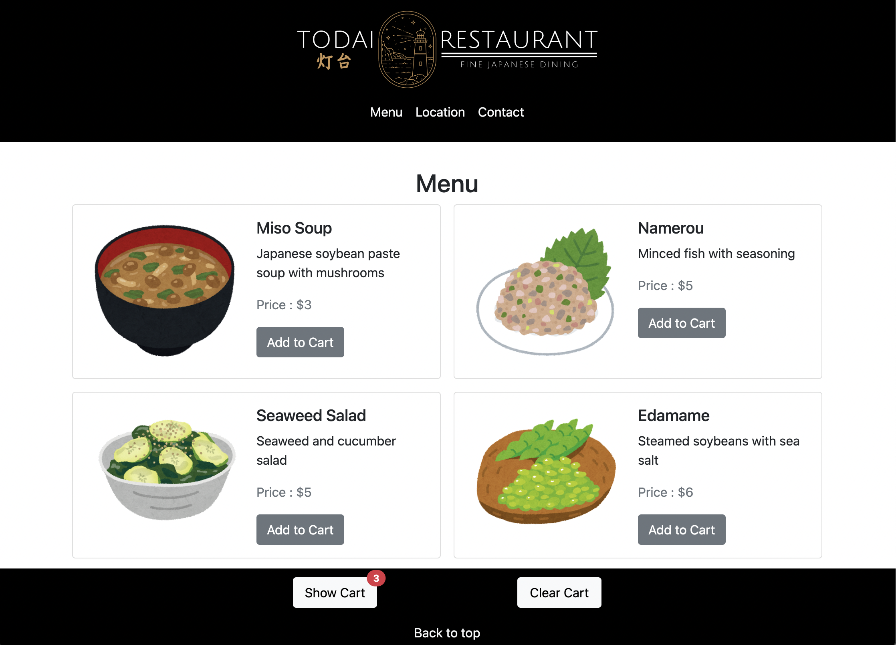
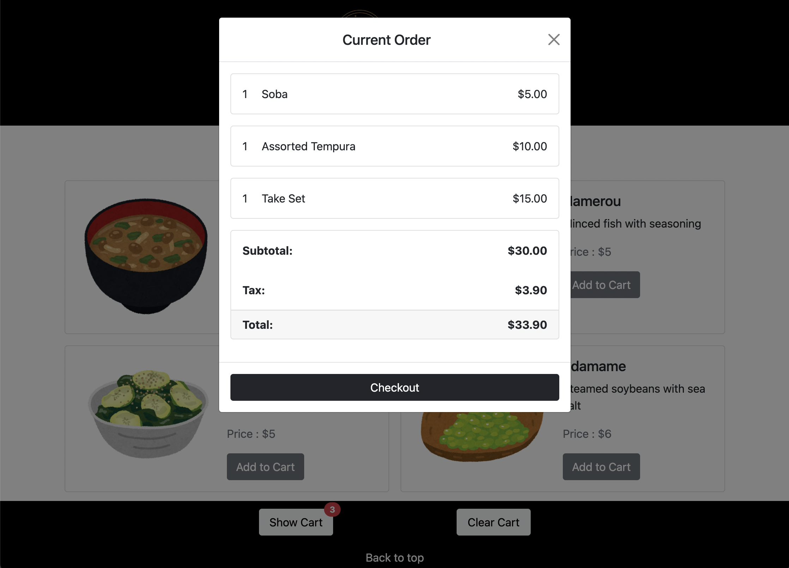
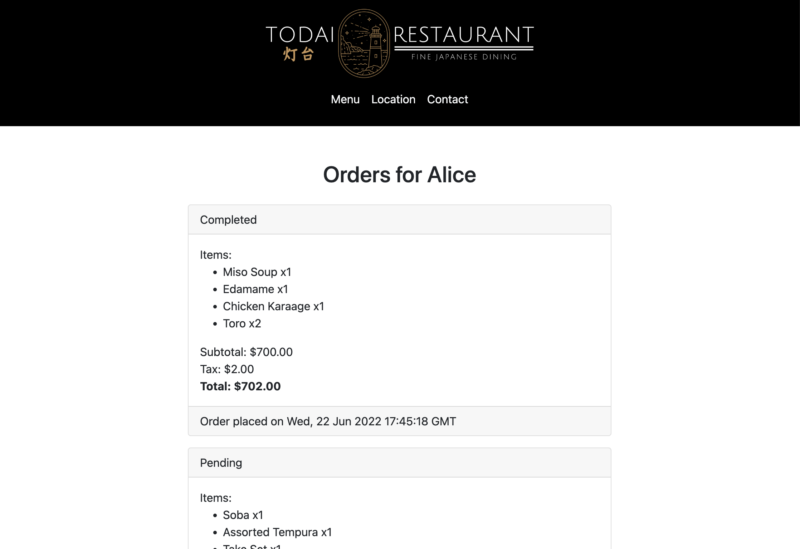
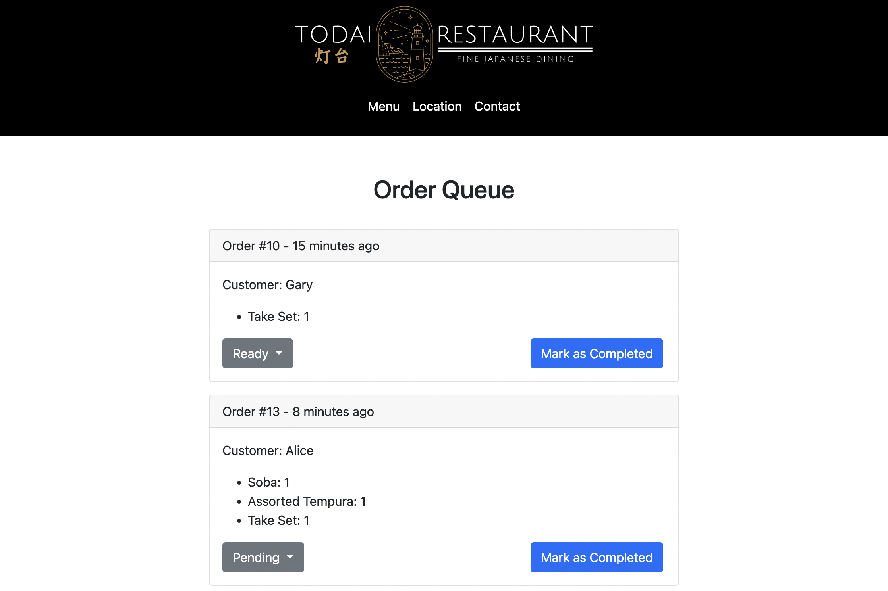

# Todai Ordering

This is a restaurant ordering application for a fictional Japanese restaurant. Users can browse the menu, create orders, see past orders, and receive text message notifications when their orders are completed. The restaurant can see their order queue and mark orders complete, sending a text message notification to the respective customer.

This application was created withing one week as a midterm project for **Lighthouse Labs' Web Development Bootcamp**.

The restaurant name, **Todai Restaurant** was chosen as *Todai* means *lighthouse* in Japanese.

## Views
### User views
- Menu

- Cart

- Order confirmation

- User's orders

### Restaurant views
- Restaurant's order queue

## Getting Started

1. Create the `.env` by using `.env.example` as a reference: `cp .env.example .env`
2. Update the .env file with your correct local information
   - A [Twilio](https://www.twilio.com/) account is needed for text message notification
3. Install dependencies: `npm i`
4. Fix to binaries for sass: `npm rebuild node-sass`
5. Reset database: `npm run db:reset`
  - Check the db folder to see what gets created and seeded in the SDB
7. Run the server: `npm run local`
  - Note: nodemon is used, so you should not have to restart your server
8. Visit `http://localhost:8080/`
8. Login as customer #1 to make orders [`http://localhost:8080/login/1`](http://localhost:8080/login/1)

## Key Pages
- Menu [`http://localhost:8080/menu`](http://localhost:8080/menu)
- User orders (customer #1) [`http://localhost:8080/orders/user/1`](http://localhost:8080/orders/user/1)
- Restaurant order queue [`http://localhost:8080/orders/queue`](http://localhost:8080/orders/queue)

## Stack 
- JavaScript
- HTML/CSS
- EJS
- Express
- Bootstrap

## Dependencies

- Node 10.x or above
- NPM 5.x or above
- PG 6.x
- nodemon
- Express 
- EJS
- Morgan
- Sass
- Cookie Session
- Twilio

## Contributers
- **Sarah Dela Cruz** [@sarahdeecee](https://github.com/sarahdeecee)
- **Miguel Dizon** [@miged](https://github.com/miged)
- **Gouthami Kolla** [@gouthamikolla](https://github.com/gouthamikolla)
